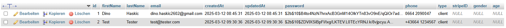
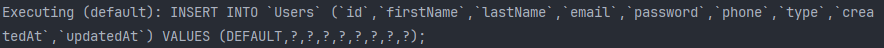
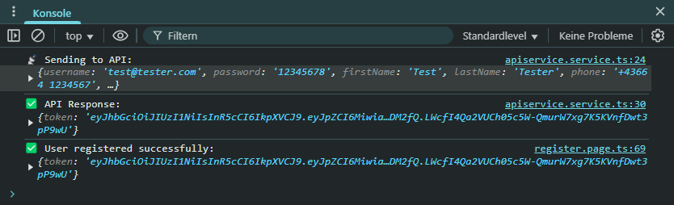
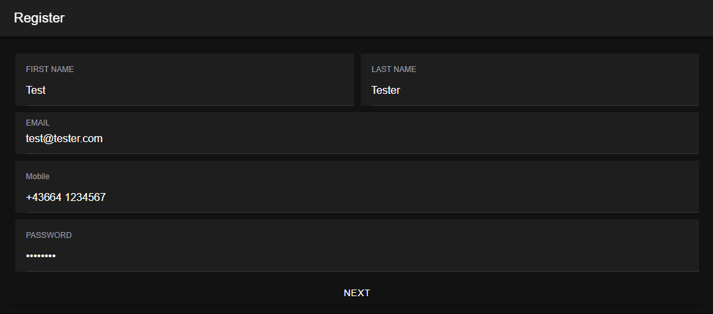

# Ionic Taxi App – Erweiterte Registrierung

## Übersicht
Dieses Projekt erweitert die Taxi-App um eine **erweiterte Registrierung**. Neben Benutzername, E-Mail und Passwort werden nun zusätzliche Felder wie Vorname, Nachname und Telefonnummer erfasst und in der MySQL-Datenbank gespeichert.  

- **Ionic** als Frontend (Formular mit erweiterten Feldern)  
- **Node.js + Express + Sequelize** als Backend  
- **MySQL** als Datenbank zur Speicherung der Benutzer

## Features
- **Erweitertes Registrierungsformular:** Zusätzliche Felder wie `firstName`, `lastName`, `phone`, `type`, `area`.
- **API-Aufruf mit Angular HttpClient:** Daten werden an `POST /api/register` gesendet.
- **MySQL-Datenbank:** Alle Felder werden in der Tabelle `Users` gespeichert.
- **Konsole & Terminal:** Debugging-Informationen in Browserkonsole und Node-Konsole.

## Technologien

---

Schritte zur Implementierung
Backend: User Model Implementierung (Sequelize)

Wo: In der Datei backend/models/user.js
Was:
Hier definierst du mit Sequelize das Schema für den Benutzer.
Du legst Felder wie username, password, email und ggf. weitere Felder (z. B. firstName, lastName, phone, etc.) fest.
Beispielcode:
js
Kopieren
module.exports = (sequelize, DataTypes) => {
  const User = sequelize.define('User', {
    username: {
      type: DataTypes.STRING,
      allowNull: false,
      unique: true,
    },
    password: {
      type: DataTypes.STRING,
      allowNull: false,
    },
    email: {
      type: DataTypes.STRING,
      allowNull: false,
      unique: true,
    },
    // Weitere Felder hinzufügen, falls benötigt
    firstName: DataTypes.STRING,
    lastName: DataTypes.STRING,
    phone: DataTypes.STRING,
  });
  return User;
};
Warum: Dieses Model stellt sicher, dass alle Benutzerinformationen korrekt strukturiert in der MySQL-Datenbank gespeichert werden.
Unterschied zu Screenshots:
Implementierungsschritt: Beschreibt den Code, den du schreibst.
Screenshot: Zeigt das Ergebnis in der Datenbank (z. B. einen Eintrag in der Tabelle Users).
Backend: API-Endpunkt für Registrierung

Wo: In der Datei backend/routes/login.js (oder einer separaten Datei, falls du die Routen trennst)
Was:
Erweitere den Registrierung-Endpunkt, sodass er neben username, password und email auch die neuen Felder (wie firstName, lastName, phone, etc.) übernimmt und in das User Model schreibt.
Beispielcode:
js
Kopieren
router.post('/register', async (req, res) => {
  try {
    const { username, password, email, firstName, lastName, phone } = req.body;
    const user = await User.create({ username, password, email, firstName, lastName, phone });
    res.status(201).json({ success: true, data: user });
  } catch (error) {
    res.status(500).json({ success: false, message: error.message });
  }
});
Warum: Damit wird beim Registrieren ein neuer Benutzer mit allen erforderlichen Daten in die Datenbank geschrieben.
Frontend: Registrierungsformular anpassen

Wo: In der Datei taxiApp/src/app/pages/register/register.page.html
Was:
Ergänze das Formular um zusätzliche Eingabefelder (z. B. Vorname, Nachname, Telefonnummer).
Beispiel:
html
Kopieren
<ion-item>
  <ion-label position="floating">First Name</ion-label>
  <ion-input [(ngModel)]="firstName" name="firstName"></ion-input>
</ion-item>
<ion-item>
  <ion-label position="floating">Last Name</ion-label>
  <ion-input [(ngModel)]="lastName" name="lastName"></ion-input>
</ion-item>
<ion-item>
  <ion-label position="floating">Phone</ion-label>
  <ion-input [(ngModel)]="phone" name="phone" type="tel"></ion-input>
</ion-item>
Wo und wie:
Die zugehörige register.page.ts-Datei muss die neuen Variablen (firstName, lastName, phone) definieren und in der onRegister()-Methode an den AuthService übergeben.
Beispiel:
ts
Kopieren
export class RegisterPage {
  username: string = '';
  email: string = '';
  password: string = '';
  firstName: string = '';
  lastName: string = '';
  phone: string = '';

  constructor(private authService: AuthService) {}

  onRegister() {
    this.authService.register(this.username, this.password, this.email, this.firstName, this.lastName, this.phone)
      .subscribe({
        next: (res: any) => { console.log('Register success:', res); },
        error: (err: any) => { console.error('Register error:', err); }
      });
  }
}

5. **Testen**  
   - `node index.js` im Ordner `backend` → Backend auf Port 3000 starten  
   - `ionic serve` im Ordner `taxiApp` → Ionic-Frontend auf Port 8100 starten  
   - `http://localhost:8100/register` aufrufen, Formular ausfüllen, „Register“ klicken.  
   - Erfolgreiche Einträge in der DB prüfen (z. B. phpMyAdmin oder MySQL Workbench).

---

## Screenshots

1. **Eintrag in der Datenbank**
- 
   
2. **Terminal Log**
- 

3. **Browser-Konsole**
- 

4. **Register-Page UI**
- 

### Code-Referenzen
- Backend-Routen (z. B. [api/register](https://github.com/dino-2602/newIonicApp/blob/master/taxiApp/src/app/register/register-routing.module.ts))
- User-Model [Sequelize](https://github.com/dino-2602/newIonicApp/blob/master/taxiBackend/models/user.js)
- RegisterPage [Frontend](https://github.com/dino-2602/newIonicApp/blob/master/taxiApp/src/app/register/register.page.html)
- Installation & Start

### Backend
cd backend
npm install
node index.js
Server läuft auf http://localhost:3000/.

### Frontend
cd ../taxiApp
npm install
ionic serve
App läuft auf http://localhost:8100/.

### Test
Gehe in den Browser: http://localhost:8100/register
Fülle alle Felder aus und klicke „Register“
Überprüfe die Datenbank, ob der neue Eintrag erstellt wurde.
