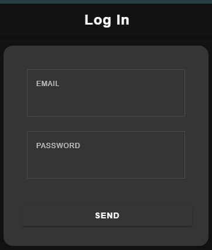
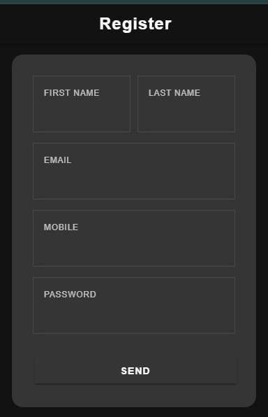
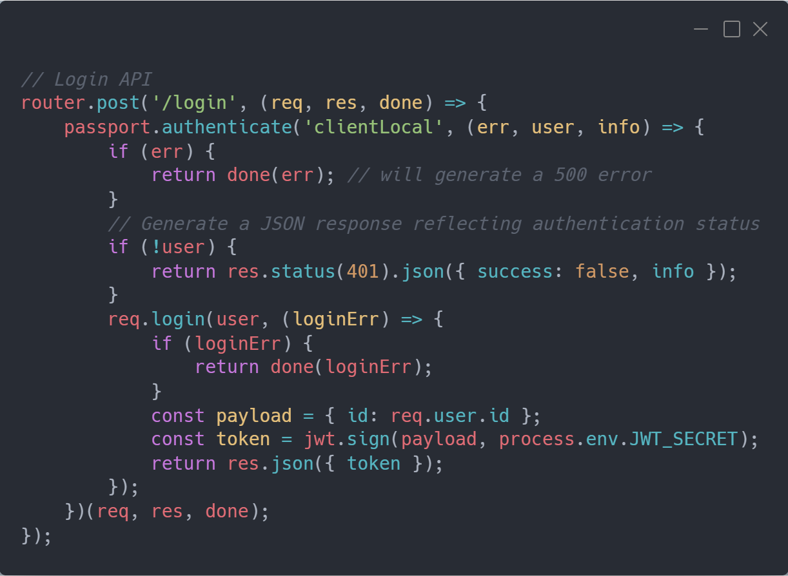
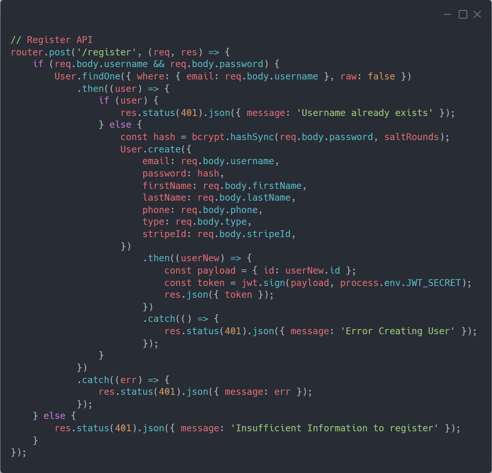

# Ionic – Login & Register mit Node.js Backend

## Übersicht
In diesem Projekt wurde das Frontend einer Ionic-Anwendung mit modernen Login- und Registrier-Funktionen erweitert. Im Hintergrund läuft ein Node.js-basiertes Backend, das Datenbank-Abfragen, Authentifizierung und persistente Speicherung ermöglicht.

- **Frontend:** Verwendung des Ionic Frameworks (inklusive Angular) für die Login- und Register-Ansichten, Styling mit SCSS und responsiver Gestaltung.
- **Backend:** Implementierung mit Node.js, Express und (bei Bedarf) Anbindung an eine MySQL-Datenbank.

## Lernziele & Aufgabenstellung
Das Projekt soll demonstrieren, wie Ionic als Frontend-Technologie arbeitet und mittels Angular/TypeScript REST-API-Requests an ein Node.js-Backend sendet. Dabei werden folgende Punkte beleuchtet:

- Die Grundlagen von Angular (Reactive Forms, HTTP-Requests) im Kontext von Ionic.
- Die serverseitige Verarbeitung mittels Node.js/Express.
- Die Rolle von Cordova, um auf native Funktionen (z. B. Kamera) zuzugreifen.
- Die notwendigen Schritte für die Entwicklung einer iOS-App (Mac OS X, Xcode, ios-sim).

## Features

### 1. Login & Register Views
- Moderne Oberfläche mit Farbverlauf-Hintergrund, animiertem Hover-Effekt und responsivem Layout.
- Formulare mit *Reactive Forms* (Angular FormGroup) zur Validierung von Eingaben wie E-Mail, Passwort, Vor- und Nachname.
- Eingabefelder werden in den zugehörigen TypeScript-Dateien verarbeitet und per HTTP-Request an das Backend gesendet.

### 2. Benutzerverwaltung
- Erstellung und Anmeldung von Benutzern.
- Frontend-Validierung (z. B. E-Mail-Format, Mindestlänge des Passworts).
- Rückmeldung vom Backend (JSON, HTTP-Statuscodes) wird verarbeitet und z. B. zur Navigation oder Fehlermeldung genutzt.

### 3. Backend-Anbindung (Node.js)
- REST-API-Endpunkte für Login und Registrierung.
- (Optional) MySQL-Datenbankanbindung, beispielsweise über Sequelize.
- Sicherheitsaspekte wie Passwort-Hashing (z. B. mit bcrypt) und Fehlerbehandlung.

## Technologien

  
  
  
  
  


> **Hinweis:** Sensible Daten wie Datenbankzugänge und Tokens werden in `.env`-Dateien oder ähnlichen Konfigurationsdateien gehalten und **nicht** im Repository abgelegt.

## Funktionsweise – Zusammenspiel Frontend & Backend

### Frontend (Ionic / Angular / TypeScript)

**TypeScript-Logik:**  
In den TypeScript-Dateien (z. B. `login.component.ts` und `register.component.ts`) werden FormGroups definiert, welche die Benutzereingaben validieren.  
Bei der Formularübermittlung ruft eine Methode (z. B. `login()`) den Angular HttpClient auf, um die Daten an einen entsprechenden API-Endpunkt im Backend zu senden:

```typescript
this.http.post('http://localhost:3000/api/login', this.user.value)
  .subscribe(response => {
    // Erfolg: Navigation oder Anzeige einer Erfolgsmeldung
  }, error => {
    // Fehlerbehandlung: Fehlermeldung anzeigen
  });
```

### UI und Styling:
- Die HTML-Templates nutzen Ionic-Komponenten wie ion-header, ion-content und ion-grid und werden durch SCSS-Dateien stilistisch modern und responsiv gestaltet.
- Beispiel: Ein Farbverlauf wird über CSS-Variablen (z. B. --primary-color und --background-gradient) definiert, und Animationen wie fadeIn sorgen für ein dynamisches Erscheinungsbild.

### Backend (Node.js / Express)
- Der Express-Server wird in einer zentralen Datei (z. B. server.js) initialisiert.
- API-Routen wie POST /login und POST /register werden definiert, um die vom Frontend gesendeten Daten zu verarbeiten.

### Authentifizierung und Datenverarbeitung:
- Eingehende Anfragen werden validiert, Passwörter werden gehasht und bei erfolgreicher Authentifizierung wird eine JSON-Antwort an das Frontend zurückgegeben.

### Datenbankanbindung (optional):
- Mittels Sequelize (oder einem anderen ORM) werden Modelle definiert und Migrationen durchgeführt, um eine persistente Speicherung in einer MySQL-Datenbank zu gewährleisten.

## Schritte zur Implementierung
1. Frontend – Ionic
- Anlegen von Login- und Registrierungsseiten mit Angular Reactive Forms.
- Verwendung von Ionic-Komponenten (z. B. ion-input, ion-button).
- Definition von Farbverläufen und responsiven Layouts in SCSS.
- Einbau von Animationen, um ein modernes Benutzererlebnis zu schaffen.

2. Backend – Node.js / Express
- Einrichtung eines Express-Servers und Definition der benötigten API-Routen.
- Datenbankanbindung (optional):
- Aufbau einer Verbindung zu einer MySQL-Datenbank (z. B. mit Sequelize).

- Implementierung von Passwort-Hashing und robusten Fehlerbehandlungsroutinen.

3. Integration & Testing
- Senden der Formulardaten vom Frontend per HTTP-Request an das Backend.
- Verarbeitung der Rückmeldungen (Statuscode, JSON) zur weiteren Steuerung der Benutzeroberfläche.
- Testen des responsiven Designs und der Benutzerinteraktionen (z. B. bei verschiedenen Bildschirmgrößen).
- Überprüfung der API-Routen mittels Tools wie Postman oder via Unit-Tests.

## Screenshots

### Login Screen
- 

### Register Screen
- 

### Backend Routes
- Login API: 
- Register API: 

## Code-Referenzen
- Frontend (Ionic) [Frontend]()
- src/app/auth/login.component.ts / .html / .scss [Login]()
- src/app/auth/register.component.ts / .html / .scss [Register]()

#### Backend (Node.js / Express)
- backend/server.js (Express-Startpunkt) [Server.js]()
- backend/routes/auth.js (API-Routen für Login & Registrierung) [routes/auth.js]()
- backend/models/ (Datenbankmodelle, falls Sequelize oder ein anderes ORM verwendet wird) [models/]()

## Installation
Voraussetzungen
Node.js (Version 14 oder höher):
https://nodejs.org

Cordova & Ionic:
Nach der Installation von Node.js:

```bash
npm install -g cordova ionic
iOS-Entwicklung:
Für die Entwicklung von iOS-Apps ist ein Mac OS X-System mit Xcode und ggf. ios-sim erforderlich:
```

```bash
sudo npm install -g ios-sim
Frontend einrichten
Repository klonen:
```

```bash
git clone https://github.com/dein-repo/src_frontend.git
cd src_frontend
npm install
```

## App im Terminal / IDE Terminal starten:
```bash
ionic serve
```

### Repository klonen:

```bash
git clone https://github.com/dein-repo/taxiBackend.git
cd taxiBackend
npm install
(Optional) .env-Datei mit deinen Datenbank- und API-Konfigurationen erstellen.
```

### Server starten:
```bash
npm start
```

## Zusammenfassung
Dieses Projekt zeigt, wie das Ionic Framework in Kombination mit Angular und TypeScript ein modernes Frontend bereitstellt, das über HTTP-Requests mit einem Node.js/Express-Backend kommuniziert. Während das Frontend responsives Design, animierte Übergänge und moderne Formulare bietet, kümmert sich das Backend um Authentifizierung, Datenvalidierung und persistente Speicherung (ggf. mit MySQL). Die Installation und Konfiguration der erforderlichen Tools (Node.js, Cordova, Ionic) sowie die Besonderheiten der iOS-Entwicklung werden dabei detailliert beschrieben.
