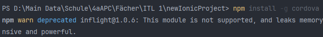
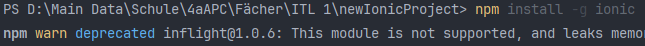
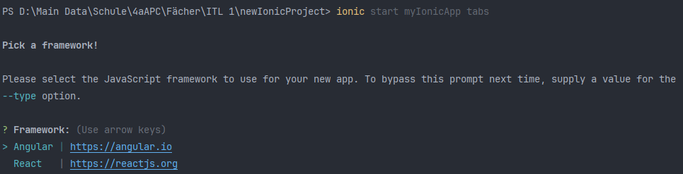
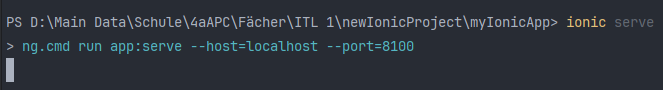
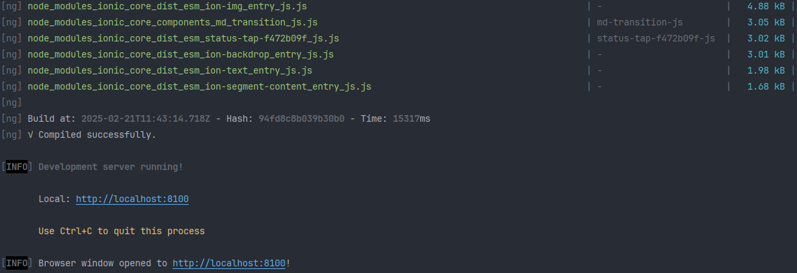
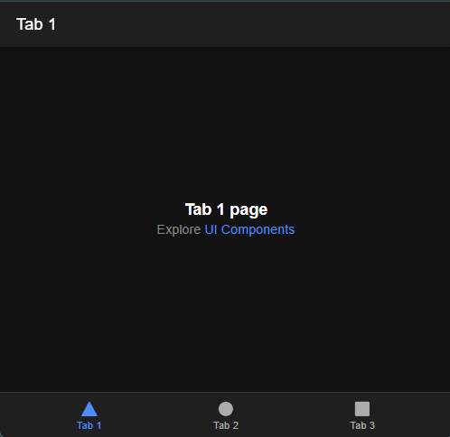

# MyIonicApp – Ionic Tabs

## Übersicht
Dieses Projekt demonstriert die Grundinstallation und Verwendung des Ionic Frameworks (in Kombination mit Angular) für eine einfache Tabs-Applikation. Die folgenden Punkte wurden im Rahmen eines Laborberichts umgesetzt:

- **Installation von Node.js** zur Bereitstellung der npm-Umgebung.
- **Globale Installation von Cordova und Ionic** via npm.
- **Erstellung einer Demo-App** mit dem `tabs` Starter-Template.
- **Testen via `ionic serve`** und Anzeigen im Browser.
- **Kurzer Hinweis** zur iOS-Entwicklung (Mac, Xcode etc.).

## Features
- **Tabs-Navigation**: Vordefiniertes Layout für eine App mit mehreren Tabs.
- **Schneller Start**: Durch das Starter-Template sind nur wenige Schritte nötig, um eine lauffähige App zu erhalten.
- **CLI-basierter Workflow**: Einfache Befehle wie `ionic start`, `ionic serve`, `ionic build`.

## Technologien


⚠️**Hinweis:** Dieses Repository enthält ausschließlich das Grundgerüst der Ionic-App (z. B. `src`-, `www`- und Konfigurationsdateien). Persönliche Daten, sensible Konfigurationen oder Backend-Zugangsdaten sind hier nicht enthalten.

## Schritte zur Implementierung

1. **Node.js überprüfen bzw. installieren**
  - Mit `node -v` prüfen, ob Node.js installiert ist.
  - Falls nicht vorhanden, Node.js von [https://nodejs.org](https://nodejs.org) herunterladen und installieren.

2. **Cordova & Ionic Installation**
  - Global mit npm installieren:
    ```bash
    npm install -g cordova
    npm install -g ionic
    ```
  - Anschließend Versionen prüfen (`cordova -v`, `ionic -v`).

3. **Neues Projekt erstellen**
  - In der Konsole oder IDE:
    ```bash
    ionic start myIonicApp tabs
    ```
  - Bei der Abfrage „Pick a framework“ wurde hier **Angular** ausgewählt.

4. **Entwicklung & Test**
  - Projektverzeichnis wechseln: `cd myIonicApp`
  - App starten: `ionic serve`
  - Browser öffnet sich unter [http://localhost:8100](http://localhost:8100).

5. **Hinweis zur iOS-Entwicklung**
  - Für die Entwicklung unter iOS wird ein Mac mit Xcode benötigt.
  - Ionic/Cordova-Plattform: `ionic cordova platform add ios` (nur auf macOS).
  - Zum Testen im Simulator: `ionic cordova emulate ios`.
  - Für ein echtes Gerät und App Store-Veröffentlichung ist ein Apple Developer Account notwendig.

## Screenshots

### **Cordova-Installation**
  
*Globale Installation von Cordova über npm.*

---

### **Ionic-Installation**
  
*Globale Installation von Ionic über npm.*

---

### **Framework-Auswahl**
  
*Auswahl von Angular als Framework beim Erstellen des Projekts.*

---

### **Kommando `ionic serve`**
  
*Starten des lokalen Entwicklungsservers.*

---

### **Kompilierung erfolgreich**
  
*Erfolgreiche Kompilierung der App – Server läuft auf Port 8100.*

---

### **Ansicht im Browser**
  
*Die Tabs-Demo-App wird im Browser angezeigt.*

## Code-Referenzen
Da es sich hier um das Standard-Tabs-Template handelt, gibt es keine speziellen Code-Dateien, die über das Standard-Setup hinausgehen.
- `src/app/app.module.ts` (Hauptmodul)
- `src/app/app.component.ts` (Root-Komponente)
- `src/app/tab1/tab1.page.ts` (Beispiel einer Tab-Seite)

## Installation

1. **Repository klonen** (oder das Projektverzeichnis in phpStorm öffnen):
   ```bash
   git clone https://github.com/dino-2602/newIonicApp
