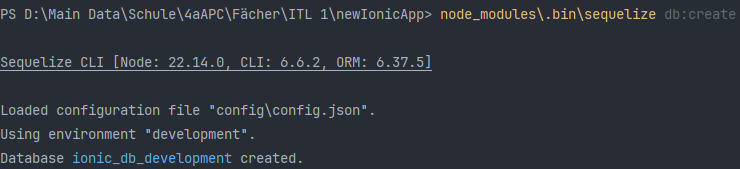
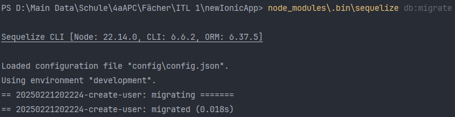
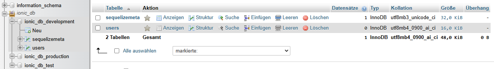
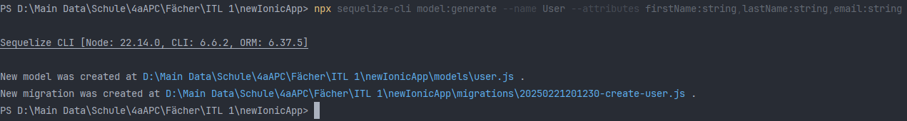
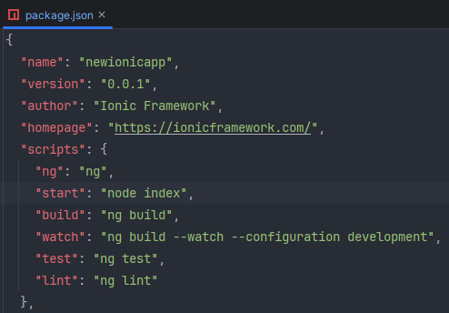
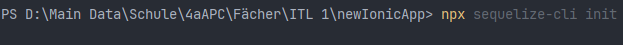
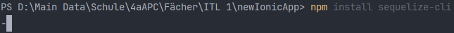

# Ionic Taxi App – Datenbank & Backend

## Übersicht
Dieses Projekt erweitert die bestehende Taxi-App um ein robustes Backend, das mit Node.js, Express, MySQL und Sequelize realisiert wurde. Ziel ist es, eine performante, skalierbare und sichere API zu bieten, die die Kommunikation zwischen der mobilen Ionic-Anwendung und der Datenbank optimiert.
- Einrichtung und Migration der MySQL-Datenbank
- Implementierung von RESTful API-Endpunkten
- Verwendung von Sequelize für eine saubere Datenbankabstraktion

## Features
- **RESTful API:** Modular entwickelte Endpunkte mit Express.
- **Datenbankintegration:** Verwendung von MySQL in Kombination mit Sequelize ORM.
- **Migration & Synchronisation:** Automatisierte Datenbankmigrationen und Modelldefinitionen.
- **Sicherheit & Wartbarkeit:** Strukturierte Backend-Logik unter Einsatz aktueller Best Practices.

## Technologien


⚠️ **Hinweis:** In diesem Repository wurden ausschließlich die für das Backend relevanten Ordner hochgeladen. Konfigurationsdateien und sensible Daten (z. B. Datenbankzugangsdaten) wurden absichtlich weggelassen, um höchste Sicherheit zu gewährleisten.

## Schritte zur Implementierung

1. **Datenbank-Setup & Migration:**
  - Erstellung der MySQL-Datenbank und Konfiguration der Verbindung.
  - Einrichtung und Ausführung von Sequelize-Migrationen zur Initialisierung der Datenbankstruktur.
  - Definition und Synchronisation der Datenbankmodelle.

2. **Implementierung der RESTful API:**
  - Aufbau der API-Routen mit Express.
  - Integration der Sequelize-Modelle in die Controller-Logik.
  - Implementierung von Sicherheits- und Authentifizierungsmechanismen.

3. **Testing & Optimierung:**
  - Durchführung von Funktionstests und Performance-Optimierungen.
  - Sicherstellung der Kompatibilität mit dem Ionic-Frontend der Taxi-App.

## Screenshots

### Screenshot 1: Datenbank-Erstellung


### Screenshot 2: Migration der Datenbank


### Screenshot 3: Übersicht der Datenbanktabellen


### Screenshot 4: Ausführung von npx Sequelize-Befehlen


### Screenshot 5: package.json Übersicht


### Screenshot 6: Sequelize CLI Initialisierung


### Screenshot 7: Sequelize CLI Befehle


### Screenshot 8: Ausgabe von Sequelize


## Code-Referenzen
- [Server Entry Point (server.js)](https://github.com/your_repository/taxi-app-backend/blob/main/server.js)
- [API Controller](https://github.com/your_repository/taxi-app-backend/blob/main/controllers/apiController.js)
- [Datenbankmodelle](https://github.com/your_repository/taxi-app-backend/blob/main/models/)
- [Sequelize Migrationen](https://github.com/your_repository/taxi-app-backend/blob/main/migrations/)

## Installation

Klone dieses Repository und installiere die Abhängigkeiten:

```bash
git clone https://github.com/dino-2602/newIonicApp
cd taxi-app-backend
npm install
