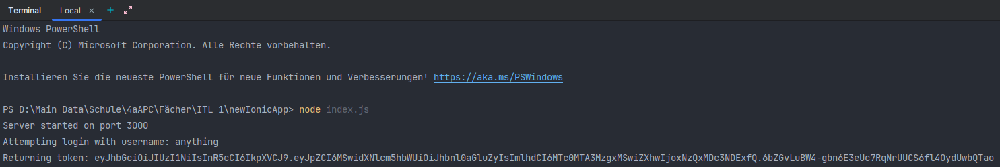
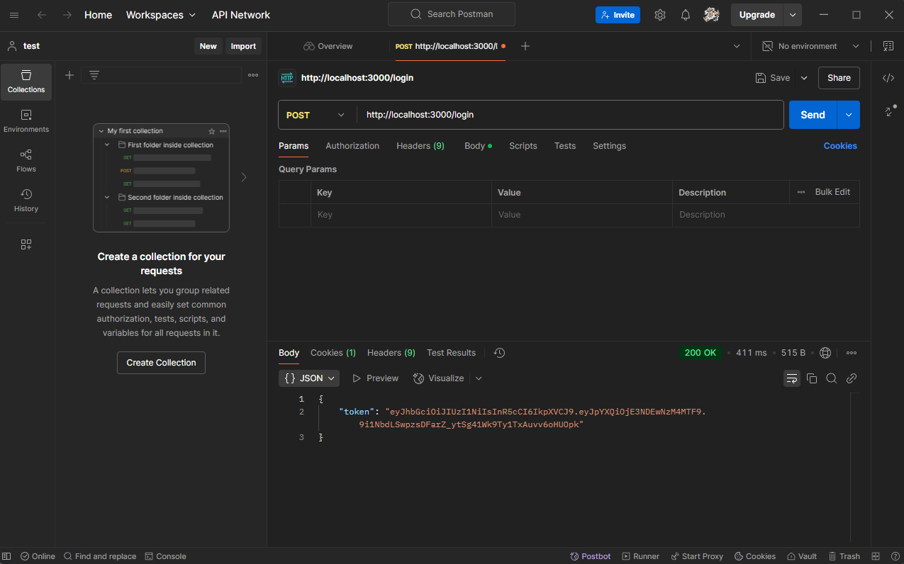

# Ionic Taxi App–Backend (Part 2)

## Übersicht
Dieses Projekt erweitert die bestehende Taxiapp um ein robustes Backend, das mit **Node.js**, **Express**, **MySQL** und **Sequelize** realisiert wurde.  
Ziel ist es, eine performante, skalierbare und sichere RESTful API bereitzustellen, die die Kommunikation zwischen der mobilen Ionic-Anwendung und der Datenbank optimiert.
- Einrichtung und Migration der MySQL‑Datenbank (bereits im vorherigen Part eingerichtet)
- Implementierung von API‑Endpunkten für Registrierung, Login und CRUD‑Operationen am User‑Modell
- Saubere Trennung der Backend‑Logik durch modulare Routen

## Features
- **RESTful API:** Modular entwickelte Endpunkte mit Express
- **Datenbankintegration:** Verwendung von MySQL in Kombination mit Sequelize ORM
- **Migration & Synchronisation:** Automatisierte Datenbanksynchronisation anhand der Modelldefinitionen
- **Sicherheit & Wartbarkeit:** Strukturierte Backend‑Logik unter Einsatz aktueller Best Practices

## Technologien


> ⚠️ **Hinweis:** In diesem Repository wurden ausschließlich die für das Backend relevanten Ordner hochgeladen. Konfigurationsdateien und sensible Daten (z. B. Datenbankzugangsdaten) wurden bewusst weggelassen, um höchste Sicherheit zu gewährleisten.

---

## Schritte zur Implementierung

1. **Backend‑Setup und Implementierung der RESTful API:**
  - In `index.js` wird der Express‑Server initialisiert, `body-parser` eingebunden und die Datenbank synchronisiert.
  - Die API‑Routen aus `routes/login.js` werden unter dem Pfad `/api` eingebunden.
  - Ein Terminal-Screenshot, der den erfolgreichen Start des Servers (z. B. "Datenbank synchronisiert" und "Server läuft auf Port 3000") zeigt. (Runterscrollen zu Screenshots)

2. **Routen und API-Endpunkte:**
  - Die Datei `routes/login.js` enthält alle API‑Endpunkte:
    - `POST /api/register` – Registrierung eines neuen Benutzers
    - `POST /api/login` – Login basierend auf Benutzername und Passwort
    - `GET /api/user/:id`, `PUT /api/user/:id`, `DELETE /api/user/:id` – Lesen, Aktualisieren und Löschen von Benutzern

3. **Testing & Optimierung:**
  - Nachdem der Server mit `node index.js` gestartet wurde, können die Endpunkte mit Tools wie Postman getestet werden.
  - Beispiel: Sende einen `POST`‑Request an `http://localhost:3000/api/register` mit folgendem JSON-Body:
    ```json
    {
      "username": "testuser",
      "password": "testpass",
      "email": "test@example.com"
    }
    ```

---

## Screenshots

### Screenshot 1: Start von node index.js


### Screenshot 2: Postman - Ausgabe des Token


---

## Code-Referenzen

- [Server Entry Point (index.js)](https://github.com/dino-2602/newIonicApp/blob/master/models/index.js)
- [API-Routen (login.js)](https://github.com/dino-2602/newIonicApp/blob/master/routes/login.js)
- [Datenbankmodelle (user.js)](https://github.com/dino-2602/newIonicApp/blob/master/models/user.js)

---

## Installation & Start

1. **Repository klonen:**
   ```bash
   git clone https://github.com/dino-2602/newIonicApp
